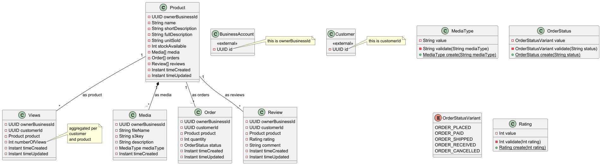

# Analysis and design

## Domain modelling

domains
- customer engagement
- products and services
- bookings
- promotions
- crm
- administration
- system

You will notice ownerBusinessId in all entities. This is to allow querying of tables individually by businessId without
resorting to complex joins that may have a performance hit. Secondly we want row level authorisation based on businessId
for each table.

### Customer engagement

#### Entities:
- customer
- conversation - lasts 24 hours and new one created
- message
- sentiment record
- customer preferences
- daily activity - summary of all entity records for the day

#### Value objects:
- phone number
- label
- label type
- message direction

#### Domain services:
sentiment service
- recordSentimentChange - method called when current sentiment of conversation changes. We have to create a new sentiment record as we are tracking sentiment dynamically. Snapshot sentiment is still stored on the conversation object.

- [link to puml file](uml/domain_modelling/customer_engagement.puml)

### Products and services
#### Enities:
- product - details of the product
- media - associated media i.e images, pdfs, videos
- order - placed orders
- review - user reviews
- view - when product is viewed by customer

#### Value objects:
- media type
- order status

- [link to puml file](uml/domain_modelling/product.puml)