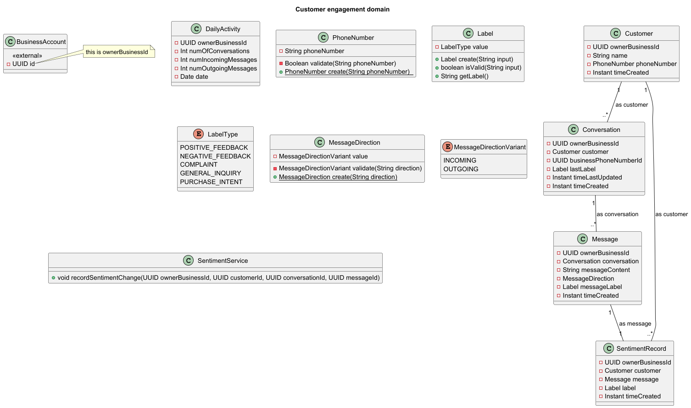

# Analysis and design

## Domain modelling

domains
- customer engagement
- products and services
- bookings
- promotions
- crm
- administration
- system

### Customer engagement

#### Entities:
customer, conversation, message, sentiment record

#### Value objects:
phone number, label and label type

#### Domain services:
sentiment service
- recordSentimentChange - method called when current sentiment of conversation changes. We have to create a new sentiment record as we are tracking sentiment dynamically. Snapshot sentiment is still stored on the conversation object.

- [link to puml file](uml/domain_modelling/customer_engagement.puml)

### Products and services